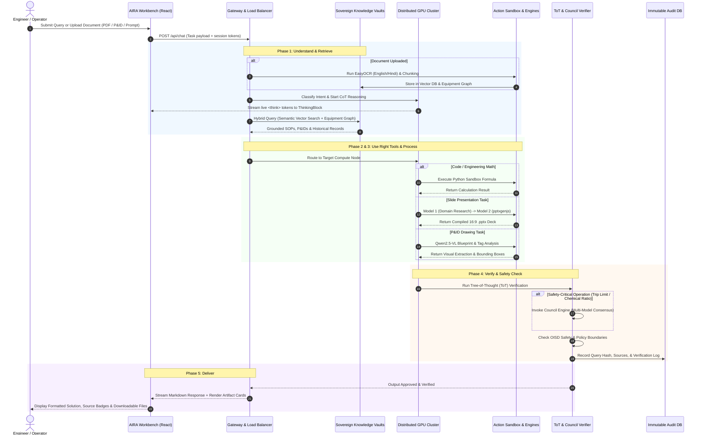

# AIRA (AI Research Assistant) — End-to-End Operational Workflow

This document specifies the end-to-end execution workflow of AIRA, from the instant a user submits an operational query or uploads an engineering document to the final delivery of verified deliverables.

---

## 1. The 5 Core Workflow Phases

AIRA executes every query through a disciplined 5-stage sovereign pipeline:

```
[ 1. Understand ] ───▶ [ 2. Use Right Tools ] ───▶ [ 3. Process ] ───▶ [ 4. Verify ] ───▶ [ 5. Deliver ]
```

1. **Understand**: Intent classification, input normalization (OCR / Text), modality detection, and Chain-of-Thought (CoT) problem decomposition.
2. **Use Right Tools**: Cluster slot allocation, node selection (`qwen3:8b` vs. `qwen2.5-coder` vs. `qwen2.5-vl`), and tool runtime initialization.
3. **Process**: Hybrid Graph-RAG retrieval, parallel subagent execution, Python sandbox calculations, and collaborative presentation compilation.
4. **Verify**: Tree-of-Thought (ToT) fact-checking, Council consensus cross-validation, and OISD refinery policy checks.
5. **Deliver**: Native file artifact generation (`.pptx`, `.docx`, `.xlsx`, `.pdf`), source grounding footnotes, and real-time streaming to the UI.

---

## 2. End-to-End Execution Sequence Diagram



---

## 3. Detailed Stage-by-Stage Workflow Breakdown

### Phase 1: Understand (Ingestion, Normalization & Routing)
- **Input Types**:
  - Raw prompts: Plain questions, operational tasks, code requests.
  - Attached Files: Scanned inspection sheets, SOP PDFs, engineering CAD/P&IDs (`.dwg`, `.png`), Excel spreadsheets.
- **Multilingual OCR Engine**:
  - `EasyOCR` normalizes scanned physical documents (English & Hindi) into clean semantic text chunks.
- **Intent Classifier**:
  - Distinguishes whether the prompt is:
    1. *Knowledge RAG Query* (e.g. "What is the SOP for pump startup?")
    2. *Engineering Math / Calculation* (e.g. "Calculate discharge head at 120 m³/hr")
    3. *Visual Diagram Analysis* (e.g. "Find block valve on suction line of T-101")
    4. *Executive Deliverable* (e.g. "Generate 5 slide presentation on Customer Churn")

---

### Phase 2: Use Right Tools (Cluster Load Balancing)
- **Node Selection**:
  - **Node 1 (`qwen3:8b`)**: Primary reasoning agent, ReAct loop planner, and conversational synthesis.
  - **Node 2 (`qwen2.5-coder:7b`)**: Code compiler, formula evaluation, Excel data transformation.
  - **Node 3 (`qwen2.5-vl`)**: Multimodal visual inference for piping & instrumentation drawings.
- **VRAM & Hardware Budgeting**:
  - Dynamic load balancer ensures active slots do not exceed hardware memory limits.

---

### Phase 3: Process (Hybrid Retrieval & Execution Runtime)
- **Dual-Engine Retrieval**:
  - **Dense Vector RAG**: Embeddings search across hundreds of MRPL technical manuals and SOPs.
  - **Relational Plant Graph**: Queries `plant_graph.gpickle` using NetworkX to trace equipment connections (e.g. *Crude Distillation Unit $\to$ Heat Exchanger E-102 $\to$ Desalter D-101*).
- **Tool Runtimes**:
  - **Python Sandbox**: Executes math and fluid dynamics formulas in an isolated, secure process.
  - **Two-Model Presentation Engine**:
    - *Agent 1 (Domain Specialist)*: Extracts structured factual insights, statistics, and slide sections.
    - *Agent 2 (Deck Compiler)*: Assembles slide components into styled widescreen 16:9 `.pptx` decks using `pptxgenjs`.

---

### Phase 4: Verify (Hallucination Control & Council Consensus)
- **Tree-of-Thought (ToT) Verifier**:
  - Evaluates each reasoning branch against retrieved documents to ensure zero unsupported claims.
- **Council Consensus Engine**:
  - For high-stakes refinery decisions (e.g. shutdown thresholds, emergency relief valves), queries multiple models independently to achieve agreement.
- **Policy & Security Check**:
  - Enforces OISD guidelines and role-based data isolation.
- **Audit Logging**:
  - Logs session metadata to `zingo_audit.db` for full compliance traceability.

---

### Phase 5: Deliver (Interactive Presentation & Artifacts)
- **UI Presentation**:
  - Expandable **Thinking Block** displays the live reasoning stopwatch and telemetry.
  - Formatted answer with syntax-highlighted code blocks and KaTeX math formulas.
  - Interactive **Presentation Card** with "Preview Slides" modal and one-click "Download .PPTX".
  - Source verification badges linking directly to referenced SOP clauses and page numbers.
