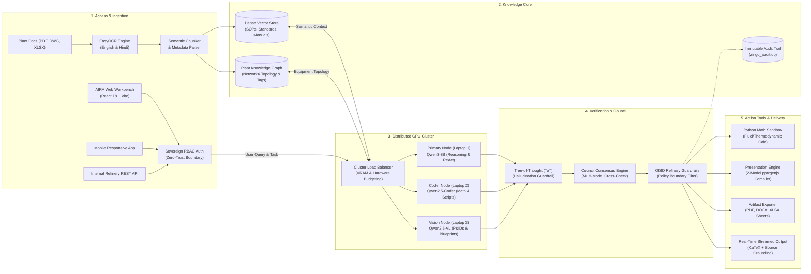

# AIRA (AI Research Assistant) — System Architecture Specification

## 1. Critique: Inaccuracies in the Previous Diagram

The previous diagram captured some functional desires but was architecturally inaccurate for a real-world enterprise AI workbench:

| # | Flaw in Previous Diagram | Why It's Inaccurate | Real Architecture in AIRA |
|---|---|---|---|
| **1** | **Linear Ingestion & Query Mixing** | Placed OCR, Document Parsing, and Vault sorting in the exact same waterfall flow as real-time user query answering. | **Dual-Pipeline Separation**: Ingestion (OCR, chunking, graph indexing) runs *asynchronously/offline*. User queries run *synchronously/online* through the Agentic Runtime. |
| **2** | **Monolithic Model "Waterfall"** | Treated model inference as a single generic "LLM Reasoning Engine" box. | **Distributed Multi-Node Cluster**: Traffic is routed across specialized hardware nodes (`qwen3:8b` reasoning, `qwen2.5-coder` calculations, `qwen2.5-vl` multimodal vision) coordinated via load balancer. |
| **3** | **No Tool Execution or Agent Runtime** | Assumed the system only retrieves context and prints text answers. | **Agent Tool Runtime**: Includes sandboxed Python computation, 2-model collaborative slide compilation (`pptxgenjs`), plant equipment graph traversals, and temporal shift reasoners. |
| **4** | **Missing Sovereign Security Perimeter** | Did not represent on-premise air-gapping, hardware VRAM budgets, or immutable compliance auditing. | **Air-Gapped Sovereign Perimeter**: 100% on-premise inference, zero external telemetry, local SQLite/gpickle state, and OISD-compliant audit trail (`zingo_audit.db`). |
| **5** | **Naive Single-Pass Retrieval** | Showed basic text search into vaults without structural understanding. | **Hybrid Graph-RAG**: Combines dense vector semantic search with a structural NetworkX Knowledge Graph of plant equipment, P&ID topology, and refinery units. |

---

## 2. Horizontal System Architecture Diagram (Left-to-Right)

---

## 3. Logical Layer Breakdown

### Layer 1: Access Channels & Ingestion
- **Client Workbench (`aira`)**: React 18, Vite, Tailwind CSS, Framer Motion with Liquid Glass and Sovereign Air-Gap indicators.
- **Access Control & RBAC**: Strict role boundaries (Operator, Engineer, Shift Lead, Safety Auditor).
- **Asynchronous Ingestion**: Multilingual `EasyOCR` extracts English & Hindi text from physical scans, normalizing formats into the Knowledge Core.

### Layer 2: Hybrid Knowledge Core
- **Dense Vector Store**: Embeddings of all MRPL Standard Operating Procedures (SOPs), inspection records, and safety standards.
- **Structural Plant Knowledge Graph (`plant_graph.gpickle`)**: Equipment connectivity graphs (pumps, valves, distillation towers, heat exchangers) for relational topological queries.
- **Sovereign State & Audit Store (`zingo_audit.db`)**: Stores query hashes, source groundings, model timestamps, and verification scores.

### Layer 3: Distributed Multi-Node Compute Cluster
AIRA does not run on a single machine; it balances inference across dedicated on-premise hardware nodes:
1. **Primary Node (`qwen3:8b`)**: Orchestrator, planning, reasoning, and context synthesis.
2. **Coder Node (`qwen2.5-coder:7b`)**: Technical script generation, calculations, formulas, and data transformations.
3. **Vision Node (`qwen2.5-vl`)**: Inspects CAD drawings, P&ID blueprints, and photo inspections.
4. **Hardware-Adaptive Orchestrator (`model_orchestrator.py`)**: Dynamically budgets VRAM, manages context limits, and routes requests across local tunnels.

### Layer 4: Council Engine & Verification
- **Tree-of-Thought (ToT) Verifier**: Explores multiple reasoning branches to weed out hallucinations before output.
- **Council Consensus Engine**: For critical refinery operations (e.g. pressure trip limits), invokes independent evaluation from multiple models to achieve consensus.
- **Refinery Safety Guardrail**: Validates facts against OISD standards before emission.

### Layer 5: Action Sandbox & Deliverables Generation
- **Python Sandbox**: Executes calculations locally without internet access.
- **Two-Model Presentation Engine**:
  - *Model 1 (Researcher)*: Extracts deep domain facts, statistics, and slide structures.
  - *Model 2 (Compiler)*: Emits formatted slide JSON and compiles standard 16:9 `.pptx` decks using `pptxgenjs`.
- **Artifact Exporters**: Generates `.docx` briefing notes, `.xlsx` datasheets, and `.pdf` reports.
