# AIRA (AI Research Assistant) — Deep System Architecture Specification

## 1. Architectural Philosophy: The 4 Sovereign Pillars + Claude-Class Workbench

AIRA is engineered as an on-premise, air-gapped sovereign intelligence platform for mission-critical industrial facilities (Mangalore Refinery & Petrochemicals Ltd). It combines the **cognitive precision and interactive workflow of Claude** with the **deterministic safety protocols and temporal equipment awareness** demanded by process manufacturing.

```
       ┌────────────────────────────────────────────────────────┐
       │                 THE 4 SOVEREIGN PILLARS                 │
       ├──────────────────────────┬─────────────────────────────┤
       │ Dynamic Autonomy Control │  T-KOG (Temporal Knowledge) │
       │ (Risk/Task Sensitivity)  │  (History, Lineage, Delta-t)│
       ├──────────────────────────┼─────────────────────────────┤
       │    Policy Bound Agent    │    Sovereign Agent Fabric   │
       │ (Zero-Trust Sandbox/SQL) │    (MCP / A2A Cluster Swarm)│
       └──────────────────────────┴─────────────────────────────┘
       
       Core Mandate: "AIRA doesn't just understand—it plans, executes, and verifies."
```

---

## 2. Complete Deep System Architecture Diagram (Unified Vertical Flow)

```mermaid
flowchart TD
    %% =========================================================================
    %% 1. SOVEREIGN CLIENT ACCESS & CLAUDE-CLASS INTERACTIVE WORKBENCH
    %% =========================================================================
    subgraph L1["1. Sovereign Client Access & Claude-Class Interactive Workbench"]
        direction LR
        UI_Web["AIRA Web Workbench<br/>(React 18 + Vite + Tailwind)"]
        UI_Canvas["Interactive Artifact Canvas<br/>(Monaco Code / HTML / SVG Preview)"]
        UI_Orbs["Cognitive Orbital Telemetry<br/>(ThinkingOrbs Live CoT Stream)"]
        RBAC["Sovereign RBAC & Local Identity<br/>(Zero-Trust Boundary)"]

        UI_Web <--> UI_Canvas
        UI_Web --> UI_Orbs
        UI_Web --> RBAC
    end

    %% =========================================================================
    %% 2. DYNAMIC AUTONOMY CONTROLLER & COGNITIVE GOVERNOR
    %% =========================================================================
    subgraph L2["2. Dynamic Autonomy Controller & Cognitive Governor"]
        direction LR
        Risk_Class["Risk & Sensitivity Classifier<br/>(Level 1: Assist | Level 2: Calc | Level 3: Swarm)"]
        Budget_Engine["Thinking Token Budgeter<br/>(Adaptive CoT 1k-8k Tokens)"]
        ReAct_Plan["ReAct Agentic Planner<br/>(Task Decomposition & Tool Selection)"]
        Auto_Pipe["Autonomous 10-Step Pipeline<br/>(Event-Driven Document Ingestion)"]
        User_Mem["Episodic User Memory<br/>(Preferences & Past Work Orders)"]

        Risk_Class --> Budget_Engine --> ReAct_Plan
        Risk_Class --> Auto_Pipe
        User_Mem --> ReAct_Plan
    end

    %% =========================================================================
    %% 3. T-KOG: TEMPORAL OFFICIAL KNOWLEDGE GRAPH & HYBRID RETRIEVAL
    %% =========================================================================
    subgraph L3["3. T-KOG: Temporal Official Knowledge Graph & Hybrid Retrieval"]
        direction LR
        Vec_Store[("Dense Vector Store<br/>(ChromaDB / SOPs, Manuals, Standards)")]
        Plant_Graph[("Plant Topology Graph<br/>(NetworkX Equipment Connectivity)")]
        Doc_Lineage[("Version Lineage Store<br/>(OISD / API Supersession & History)")]
        Delta_T["Delta-t Degradation Engine<br/>(Corrosion Rate, Wall Thinning & SLA Drift)"]
        Easy_OCR["Multilingual EasyOCR Engine<br/>(Physical Scans & Hindi/English Text)"]

        Easy_OCR --> Vec_Store
        Easy_OCR --> Plant_Graph
        Plant_Graph <--> Delta_T
        Doc_Lineage <--> Vec_Store
    end

    %% =========================================================================
    %% 4. SOVEREIGN AGENT FABRIC & DISTRIBUTED GPU SWARM (MCP / A2A)
    %% =========================================================================
    subgraph L4["4. Sovereign Agent Fabric & Distributed GPU Swarm (MCP / A2A)"]
        direction LR
        MCP_Host["Native MCP Server (JSON-RPC 2.0)<br/>(Dynamic Tool Discovery: tools/list & tools/call)"]
        Cluster_LB["Cluster Load Balancer & Tunnel Router<br/>(VRAM Budgeting & Circuit Breakers)"]
        Node1["Master Orchestrator (Laptop 1)<br/>Qwen3-8B (Reasoning & Synthesis)"]
        Node2["Multimodal Vision Node (Laptop 2)<br/>Qwen2.5-VL (P&IDs & Blueprints)"]
        Node3["Fast Coder & QA Node (Laptop 3)<br/>Qwen3-4B / Qwen2.5-Coder (Math & Scripts)"]

        MCP_Host <--> Cluster_LB
        Cluster_LB --> Node1
        Cluster_LB --> Node2
        Cluster_LB --> Node3
    end

    %% =========================================================================
    %% 5. DUAL VERIFICATION & MULTI-MODEL COUNCIL LAYER
    %% =========================================================================
    subgraph L5["5. Dual Verification & Multi-Model Council Layer"]
        direction LR
        ToT["Tree-of-Thought (ToT) Verifier<br/>(Deterministic Falsification Criteria)"]
        Council["Council Consensus Engine<br/>(Multi-Model Cross-Validation)"]
        Safety_OISD["OISD Refinery Guardrails<br/>(Statutory Safety Boundary Filter)"]
        Contradict_Check["Contradiction Firewall<br/>(Cross-Document & Baseline Check)"]

        ToT --> Council --> Safety_OISD
        Contradict_Check --> Safety_OISD
    end

    %% =========================================================================
    %% 6. POLICY BOUND AGENT & ZERO-TRUST SANDBOX RUNTIME
    %% =========================================================================
    subgraph L6["6. Policy Bound Agent & Zero-Trust Sandbox Runtime"]
        direction LR
        Path_Shield["Path Traversal Defense<br/>(Strict Workspace Boundary Enforcer)"]
        SQL_Guard["Read-Only SQL Enforcer<br/>(Destructive Query Blockage)"]
        Sandbox_Run["Sandboxed Python/Bash Runtime<br/>(/inputs/ -> /scratch/ -> /outputs/)"]
        OOXML_QA["3-Layer OOXML QA Pipeline<br/>(Content, File & Visual Validation)"]
        Audit_DB[("Immutable Audit Trail<br/>(zingo_audit.db / Hashes)")]

        Path_Shield --> Sandbox_Run
        SQL_Guard --> Sandbox_Run
        Sandbox_Run --> OOXML_QA
    end

    %% =========================================================================
    %% 7. CLAUDE-STYLE ARTIFACT DELIVERY & BEHAVIORAL LEARNING LOOP
    %% =========================================================================
    subgraph L7["7. Claude-Style Artifact Delivery & Behavioral Learning Loop"]
        direction LR
        Stream_Out["Live KaTeX & Markdown Stream<br/>(Real-Time SSE Token Stream)"]
        Deck_Gen["Presentation Engine<br/>(pptxgenjs 16:9 Deck Compiler)"]
        Doc_Exporter["Executive Report Exporter<br/>(Production .docx, .xlsx, .pdf)"]
        Action_Alerts["Role-Targeted Action Notes<br/>(Automated Engineer Dispatch & Signoff)"]
        Learn_Engine["Behavioral Learning Engine<br/>(Diff Extraction & Rule Promotion >= 3)"]

        Action_Alerts --> Learn_Engine
    end

    %% =========================================================================
    %% UNIFIED TOP-TO-BOTTOM VERTICAL CONNECTIONS
    %% =========================================================================
    RBAC -->|"1. Governed Query & Role Clearance"| Risk_Class
    ReAct_Plan <-->|"2. Hybrid Graph-RAG Retrieval"| Vec_Store & Plant_Graph
    ReAct_Plan -->|"3. Approved MCP Tool Dispatch"| MCP_Host
    Node1 & Node2 & Node3 -->|"4. Candidate Reasoning Outputs"| ToT
    Delta_T -->|"Historical Degradation Drift"| Contradict_Check
    Safety_OISD -->|"5. Enforce Statutory Boundaries"| Sandbox_Run
    Safety_OISD -.->|"Tamper-Proof Audit Logging"| Audit_DB
    OOXML_QA -->|"Validated Presentation Package"| Deck_Gen
    OOXML_QA -->|"Validated Executive Document"| Doc_Exporter
    Safety_OISD -->|"6. Emit Verified Content"| Stream_Out
    Safety_OISD -->|"Anomalies Requiring Action"| Action_Alerts
    Learn_Engine -.->|"Promoted Rules & Learned Preferences"| User_Mem
    Stream_Out -.->|"7. Real-Time Token Feed"| UI_Canvas
```



---

## 3. Deep Layer-by-Layer Technical Specification

### Layer 1: Sovereign Client Access & Claude-Class Interactive Workbench
* **Workbench UI (`/aira`)**: Built on React 18, Vite 6, Tailwind CSS, and Framer Motion. Designed with an ultra-clean, Claude-inspired typographic hierarchy (Newsreader serif headers + Plus Jakarta Sans body) to minimize cognitive fatigue during complex engineering shifts.
* **Interactive Artifact Canvas**: A dedicated split-pane canvas allowing real-time viewing and interaction with code, reports, slide decks, and data sheets without losing chat context.
* **Monaco / Prism Code Editor**: Live syntax highlighting, in-canvas execution, and diff viewing for Python scripts, thermodynamic calculations, and configuration files.
* **Cognitive Orbital Telemetry (`ThinkingOrbs`)**: Multi-phase visual telemetry that displays the internal cognitive state as live tokens stream:
  1. `Classifying Intent & Risk`
  2. `Traversing T-KOG & Standards`
  3. `Executing Sandboxed Calculation`
  4. `Council Consensus Cross-Check`
  5. `Synthesizing Verified Response`
* **Sovereign RBAC**: Zero external OAuth dependencies. Authenticates locally using signed JWT tokens mapped to plant roles (*Field Operator, Static Equipment Engineer, Rotating Specialist, Process Safety Lead, Chief Refinery Engineer*).

---

### Layer 2: Dynamic Autonomy Controller & Cognitive Governor
* **Risk & Task Sensitivity Classifier (`subagent_engine.py`)**:
  * **Level 1 (Assisted Lookup)**: Routine queries, glossary definitions, single-document summarization. Handled on a single model node with tight token budgets and zero subagent dispatches.
  * **Level 2 (Analytical Calculation)**: Unit conversions, steam table interpolations, pressure vessel thickness verification. Triggers sandboxed code execution and Hybrid RAG retrieval.
  * **Level 3 (Autonomous Swarm)**: High-consequence engineering challenges (Root Cause Failure Analysis, Tube Ruptures, High Temperature Hydrogen Attack [HTHA], HAZOP / SIL reviews, Overpressure Relief Sizing). AIRA elevates autonomy, decomposing the problem and dispatching parallel specialist nodes.
* **Thinking Token Budgeter**: Dynamically scales Chain-of-Thought (CoT) tokens from 1,024 to 8,192 based on query complexity.
* **Autonomous 10-Step Pipeline (`autonomous_pipeline.py`)**:
  Event-driven background pipeline triggered upon document upload:
  `Ingest` $\to$ `Tag Match` $\to$ `History Retrieval` $\to$ `Pattern Analysis` $\to$ `Action Note Auto-Draft` $\to$ `SOP Trigger Evaluation` $\to$ `Contradiction Detection` $\to$ `Role Alert Dispatch` $\to$ `Audit Trail Log` $\to$ `Plant Health Map Update`.
* **Long-Term Episodic Memory**: Persists user context, preferred units (SI metric vs Imperial), and plant unit assignments across sessions.

---

### Layer 3: T-KOG — Temporal Official Knowledge Graph & Hybrid RAG
* **Topological Equipment Graph (`plant_graph.gpickle`)**: NetworkX directed graph modeling physical plant equipment, piping connections, flow directions, and unit dependencies (e.g., *Atmospheric Distillation Unit (ADU) $\to$ Vacuum Column $\to$ Heat Exchanger Network*).
* **Dense Vector Store (ChromaDB)**: 100% on-premise embeddings of MRPL operating manuals, maintenance histories, and statutory standards.
* **Version & Supersession Lineage**: Tracks historical versions of standards and SOPs (e.g., identifying when OISD-130 v2.0 was superseded by v2.1) to guarantee that recommendations are grounded in active regulatory frameworks.
* **Delta-t ($\Delta t$) Degradation Engine (`temporal_reasoning.py`)**:
  * Tracks degradation across consecutive inspection dates (e.g., wall thickness measurements from 2022 $\to$ 2024 $\to$ 2026).
  * Automatically calculates thinning rate ($\text{mm/year}$) against statutory retirement thickness ($t_{\text{retire}} = 5.0\,\text{mm}$).
  * Triggers automated SLA escalation (Level 1 $\to$ Level 2 $\to$ Level 3) when unacted inspection flags exceed statutory response windows.
* **Multilingual EasyOCR**: Extracts structured English and Hindi text from physical plant scan sheets, logs, and vendor P&IDs.

---

### Layer 4: Sovereign Agent Fabric & Distributed GPU Cluster (MCP / A2A)
* **Model Context Protocol (MCP JSON-RPC 2.0 Server)**:
  * Implements the standardized MCP protocol (`/api/mcp/jsonrpc`).
  * Supports `initialize`, `tools/list`, and `tools/call`.
  * Enables internal subagents and external clients (Claude Desktop, Cursor) to dynamically discover and invoke tools without system re-architecting.
* **Cluster Load Balancer & Tunnel Router (`server.py`)**:
  * Real-time VRAM and stream tracking across three on-premise hardware nodes.
  * Pre-flight circuit breakers: probes remote node health with 30s TTL caching. If a node disconnects, AIRA falls back instantaneously to local nodes with zero UI hang.
* **Distributed Node Specialization**:
  * **Master Orchestrator (Laptop 1 - `qwen3:8b`)**: High-depth reasoning, ReAct planning, cross-domain synthesis.
  * **Vision Specialist (Laptop 2 - `qwen2.5-vl:3b`)**: P&ID blueprint analysis, corrosion visual grading, mechanical schematics.
  * **Coder / Fast QA (Laptop 3 - `qwen3:4b` / `qwen2.5-coder`)**: High-speed mathematical proofs, Python script compilation, fast conversational Q&A.

---

### Layer 5: Dual Verification & Multi-Model Council Layer
* **Tree-of-Thought (ToT) Verifier (`tot_verifier.py`)**:
  * Evaluates reasoning branches against deterministic test specifications.
  * Formulates falsification hypotheses before committing to a final engineering recommendation.
* **Council Consensus Engine (`council_engine.py`)**:
  * For safety-critical queries, dispatches the prompt to two independent model architectures simultaneously.
  * Cross-examines outputs: if discrepancies exist regarding design pressures, temperature thresholds, or metallurgy, the Council flags the conflict for human engineer signoff.
* **OISD / API Statutory Guardrails**:
  * Enforces compliance with OISD-STD-128, OISD-STD-129, OISD-130, API 510, API 570, and ASME Section VIII Division 1.
* **Contradiction Firewall**:
  * Detects when a newly uploaded document contradicts historical baseline measurements or active plant operating parameters.

---

### Layer 6: Policy Bound Agent & Zero-Trust Sandbox Runtime
* **Path Traversal Defense (`_safe_resolve_path`)**:
  * Restricts all filesystem access strictly to the sovereign workspace root. Any attempt to traverse (`../`) triggers an immediate `PermissionError`.
* **Read-Only SQL Enforcer (`execute_sqlite_query`)**:
  * Rejects all non-`SELECT` statements. Prevents SQL injection or accidental data corruption by LLM agents.
* **Three-Chamber Sandbox File Runtime (`/api/sandbox`)**:
  * `/inputs/`: Read-only mount of user files and plant data.
  * `/scratch/`: Ephemeral isolated execution directory where Python/Bash scripts run.
  * `/outputs/`: Promoted deliverables folder. Files are only moved here after passing automated QA validation.
* **3-Layer OOXML Deliverable QA Pipeline (`routers/sandbox.py`)**:
  1. *Layer 1 (Content QA)*: Scans for unexpanded template tokens (`[Insert Date]`, `Lorem ipsum`, `NaN`, `undefined`).
  2. *Layer 2 (File QA)*: Unpacks ZIP archive, verifies mandatory OPC relationships, validates XML syntax, and strips illegal raw `#` hex color prefixes that corrupt Microsoft PowerPoint.
  3. *Layer 3 (Visual QA)*: Enforces 16:9 widescreen coordinate geometry, margins, and canvas overflow boundaries.
* **Immutable Audit Trail (`zingo_audit.db`)**:
  * Append-only SQLite store recording every user query, tool execution, model timestamp, and engineer signoff with SHA-256 integrity hashes.

---

### Layer 7: Claude-Style Artifact Delivery & Behavioral Learning Loop
* **Real-Time KaTeX & Markdown Stream**:
  * Renders complex fluid dynamics, thermodynamic balances, and metallurgical stress equations natively in the browser via Server-Sent Events (SSE).
* **Automated Presentation Engine (`presentation_engine.py`)**:
  * Two-model collaborative generation: Researcher Node extracts domain insights; Compiler Node compiles them into production-ready `.pptx` decks via `pptxgenjs`.
* **Multi-Format Artifact Exporters**:
  * One-click generation of `.docx` executive briefings, `.xlsx` datasheets, and print-ready signed `.pdf` reports.
* **Signed Action Notes**:
  * Directly converts identified anomalies into formatted plant work orders complete with statutory citations, recommended actions, and digital signoff blocks.
* **Behavioral Learning Engine (`behavior_learning.py`)**:
  * Tracks text diffs when senior engineers edit AI-generated action notes before signing.
  * Extracts recurring statutory clauses, vendor criteria, and safety margin adjustments.
  * When a pattern is edited $\ge 3$ times, it is automatically promoted to an **Active System Rule** injected into future prompt contexts—enabling continuous learning without model fine-tuning.

---

## 5. Security & Air-Gap Compliance Checklist

| Requirement | Implementation Mechanism | Verification Status |
|---|---|:---:|
| **Zero External Network Calls** | 100% on-premise Ollama / vLLM local endpoints; zero telemetry. | ✅ Verified |
| **Data Immutability** | SQLite WAL mode with append-only `audit_log` table. | ✅ Verified |
| **Execution Containment** | Ephemeral subprocess sandboxing with 20s timeout and memory limits. | ✅ Verified |
| **Statutory Adherence** | OISD-STD-128/129/130, API 510/570 rules hardcoded in guardrails. | ✅ Verified |
| **Fault Tolerance** | Pre-flight circuit breaker with 30s TTL cache and auto-failover. | ✅ Verified |
| **Model Extensibility** | Native Model Context Protocol (MCP JSON-RPC 2.0). | ✅ Verified |
